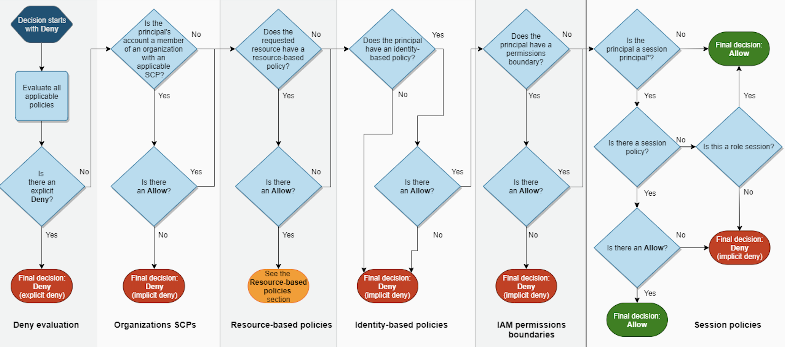
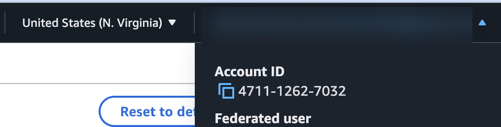
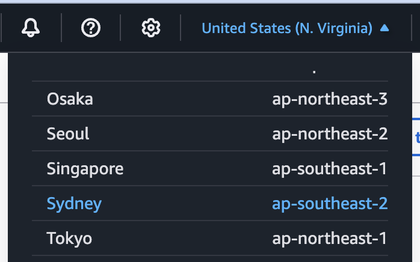
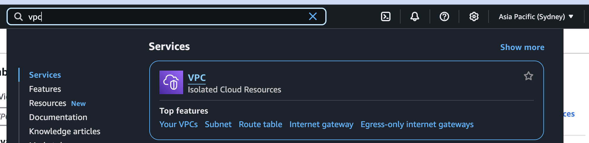
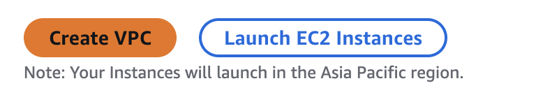
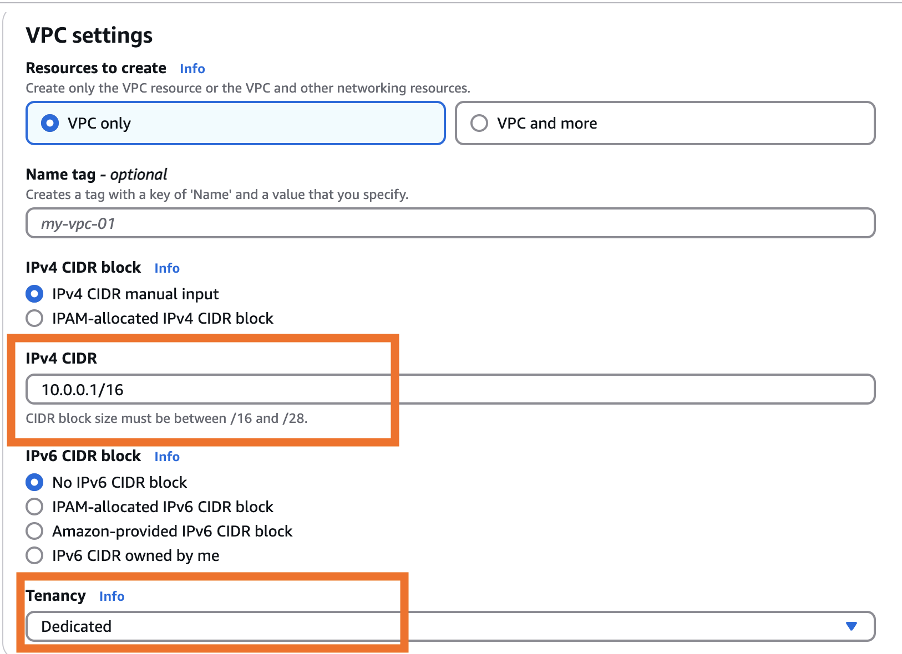

Here is my written walkthrough of the AWS Basic Concepts room in the **[Attacking and Defending AWS](https://tryhackme.com/path/outline/attackinganddefendingaws)** learning path on TryHackMe.

> ✨NOTE✨
> If you want to see some extremely cringe youtube-ing, check out my [video walkthrough](https://youtu.be/OKIMxLTA-G8?si=Q-AgMS7OQiiA0O5t) of this room.

## About this room

In this room we learn about fundamental AWS concepts like:

* AWS account management
* AWS IAM - Identity and Access Management (IAM will become your life if you want to do cloud security)
* AWS regions
* AWS organizations
* AWS networking at a very high level

It's the second room in the learning path and we start to get a bit more hands-on which is fun.

## Tasks

### Task 1 - Introduction

Provides an intro to the room and explains the learning objectives. All you do is click **Correct Answer**.

### Task 2 - AWS Account and Root User

This task covers basics about AWS accounts - which are the fundamental containers for AWS resources in AWS. We learn that:

* Each account has a unique 12-digit account ID
* Root user credentials are the only way to access AWS control plane
* Root user is considered an IAM super user with complete administrative permissions
* 🚨 Root users don't have MFA enforced by default - it is absolutely critical to set this up in any AWS account you own
* Root accounts without MFA are susceptible to weak password reset workflow attacks - search for `AWS password reset` on reddit and you will see some people that have been in the trenches!

> **NOTE**
> In most real-world work environments you will see organizational controls to enforce MFA for AWS root users - if this doesn't exist at your workplace, you should implement it!

🚩 _How many digits in AWS account ID?_
The answer is `12`. Find this under the **AWS Account** heading.

🚩 _Does AWS require MFA by default for root user credentials?_
`nay` - but make sure you implement it!

### Task 3 - Identity and Access Management (IAM)

Identity and Access Management is a fundamental security control in AWS. You will use IAM to manage authentication and authorization in the cloud. Doing IAM well is both critically important, and also not that easy. Future rooms in the learning path cover this in more detail and IMO do a nice job.

Some facts we learn in Task 3:

* IAM is the underlying system for determining access to AWS services and resources
* IAM principals are identities that AWS recognizes
* Policy evaluation logic determines access - see the chart below
* IAM roles can be temporarily assumed/switched by other identities - (NOTE: THM doesn't explicitly say this, but using IAM roles is almost always a better practice than using IAM users - more about this later)
* Trust policies determine who can assume roles
* Identity Center (formerly SSO) allows centralized access management

> **NOTE**:
> I use AWS Identity Center almost daily and overall I think it works well. I have a [cozy little video](https://youtu.be/tz0Yq1heMXw?si=CiDLABsL4oKn7roi) about how I use it on YouTube.

TryHackMe references the notorious AWS IAM policy evalutation chart which is essentially the bible when it comes to IAM.

> **NOTE**
> You can (and should!) read all about Policy evaluation logic in the [AWS docs](https://docs.aws.amazon.com/IAM/latest/UserGuide/reference_policies_evaluation-logic.html). Also, if you are just learning about this, I highly recommend the YouTube recording of the [Become an IAM Policy Master in 60 Minutes or Less](https://www.youtube.com/watch?v=YQsK4MtsELU&pp=ygUTaWFtIHBvbGljeSByZWludmVudA%3D%3D) session from re:Invent 2018 - it's a classic for a reason!

🚩 _What logic determines access of an IAM principal?_
`policy evaluation` which you can find under the **Defining AWS IAM** heading.

🚩 _What policy determines if an IAM principal can gain privileges of a role?_
`assume-role` which you can find under the **IAM Roles** heading.

### Task 4 - AWS Region

In this task we learn about the difference between **regional vs global services**. While I was familiar with this concept before playing the room, I must give a shoutout because this THM room locked this concept in my mind moreso than any training I'd done before. Here are (IMO) the most important things to remember:

#### Control plane vs data plane

In terms of the THM learning path, this gets explained a lot more in detail in a future task. But because it's referenced first here I'm going to add a little explanation.

Control planes and data planes two types of management APIs you use to manage everything you have in the cloud. 

> **NOTE**
> In the following explanation, I am going to use S3 as an example. If you are not familiar with Amazon S3 yet, this is a service where you store objects in buckets. For example your `my-bucket` bucket could store the files `file1.txt`, `file2.png`, `file3.mp4` and so on. In the real world, big organizations store petabytes of data in S3.
 
 - The control plane is like the brains of the operation and manages the infrastructure - for our S3 example, think bucket-level actions like `s3:CreateBucket`, `s3:DeleteBucket`, or `s3:PutBucketPolicy`.
 - The data plane is like the arm of the operation, moving around data and traffic amongst your cloud resources - for the S3 example, think object-level actions `s3:GetObject` or `s3:DeleteObject`.

Why does this matter here?

- **Global services use a central control plane and data plane - meaning they use central service API endpoints, almost always in `us-east-1`**
- **Regional services use regional control planes and data planes**

#### Global services

Almost every AWS service is regional, with a few notable exceptions that are worth remembering by heart, even if you don't understand yet what these services do. The important global services are:

- CloudFront
- Route 53
- Organizations
- IAM 
- STS (Security Token Service) is unique in that it has both global and regional endpoint

#### Also important

Most regions are enabled by default in new AWS accounts, but some are [disabled by default](https://docs.aws.amazon.com/accounts/latest/reference/manage-acct-regions.html) and you have to request them to be enabled.

🚩 _What AWS service has both global and regional API endpoints?_
`STS` - find this under the **Notable Global Services** heading.

🚩 _What was the default region for accounts created before 2017?_
`us-east-1` find this under the **Default Regions** heading.

### Task 5 - AWS Organizations

First of all, may I just say, I absolutely love AWS Organizations! I use it in the workplace and to manage all of my personal/hobby AWS accounts and I think once you know what you're doing with it, it's very powerful. 

The main point of AWS Organizations is to help you manage multiple AWS accounts. Almost any business today is (or should be) using multiple AWS accounts. Most enterprise settings are managing hundreds or even thousands of accounts. Many organizations also vend ephemeral accounts (created for a purpose then destroyed) using AWS Organizations and another service called [AWS Control Tower](https://docs.aws.amazon.com/controltower/latest/userguide/terminology.html).

Anyway, here's a bit of what we learn about AWS Organizations in this THM task:

* Introduced in 2017 to help manage multiple AWS accounts
* Allows workload segmentation and centralized management of multiple AWS accounts that do different jobs and hold different types of data
* Uses organizational units (OUs) to group accounts
* Service Control Policies (SCPs) can restrict access at the account or organizational unit level
* The Organizational Management Account runs the show, and SCPs do not apply to the Organizational Management Account.

🚩 _What year was AWS Organizations made GA (Generally Available)?_
`2017` - find this under the aptly named **2017 — Beginnings of AWS Organizations** heading (LOL).

🚩 _What is the sub-container for accounts in AWS Organizations?_
`Organizational unit` - find this under the **Organizational Roots, Organization Units, and Accounts** heading.

🚩 _What AWS Organizations account does service control policies not apply to?_
`Organization management account` - find this under the **Organization Policies** heading.

### Task 6 - Virtual Private Cloud (VPC)

A VPC is your virtual network in the cloud. Software-defined networking means you are manages networking (like subnetworks and routing tables) with software instead of physical components like routers and switches - in most cases, AWS abstracts away the physical aspect of networking for you.

If I had to choose one thing I think people struggle through in AWS without an underlying understanding of what they are actually doing - it's managing VPC and networking resources Myself included for several years. If you can get good at AWS networking - it's a skill that sets you apart IMO.

> **NOTE**
> My other candidate for what I think people _people struggle through in AWS without an underlying understanding of_ the most is IAM.

In this task, we learn about several key concepts like internet gateways, egress-only internet gateways, NAT gateways, how VPCs do DHCP, how VPCs do DNS, VPC endpoints public and elastic IP addressing etc. 

We also get our first exposure to the EC2 and ECS Instance Metadata Services (IMDS) endpoints. These are endpoints your AWS compute resources can talk to retrieve information about themselves. For example, an EC2 instance (server), could query the IMDS endpoint to find out its own public IP address. If you go into cloud security professionally, know that IMDS is a huge deal because attackers use it to steal AWS credentials. Very common part of attack chains in the cloud. The [2019 Capitol One breach](https://www.appsecengineer.com/blog/aws-shared-responsibility-model-capital-one-breach-case-study) is mentioned in the THM room and is probably the most famous example.

🚩 _What AWS service hosts the AWS DNS resolver?_
`Route 53` - find this under the aptly named **Default VPC Service Capabilities** heading.

🚩 _What VPC feature was used for privilege escalation in 2019 Capital One breach?_
`Instance metadata service` - find this under the **Default VPC Service Capabilities** heading.

🚩 _What type of VPC endpoint allows for network traffic inspection?_
`Gateway Load Balancer` - find this under the **VPC Endpoints** heading. BTW I think this question is phrased kind of weirdly because while it is true, typically when you think of _VPC_ endpoints you think of two types of VPC endpoints: `Gateway endpoints` and `Interface endpoints`. Whereas, `Gateway Load Balancers` are more referenced of as a type of Elastic Load Balancer. NBD but just a note about the language.

### Task 7 - Summary

Similar to the previous `AWS Cloud 101` room, we wrap up this room with a fun little static website to play with. This static website seems to be a replica of the AWS console. We are asked to do three things:

> **NOTE**
> Two of my examples below are from my one of my own demo AWS accounts, but will still apply to this task in the THM environment.

For questions 1 and 2, you simply find the element the question asks for and click it.

1. Find the 12 digit AWS Account ID

  

2. Switched regions from North Virginia (`us-east-1` my glorious comfort region) to Asia Pacific Sydney (`ap-southeast-2`)

  

3. Create a new VPC with CIDR set to the IP range `10.0.0.1/16` and tenancy set as `dedicated`. 

  1. Find the VPC service.

  

  2. Click **Create VPC**.

  

  3. Make sure your **VPC settings** follow the prompt.

  

  4. Click **Create VPC** again. This reveals the 🚩 flag 🚩.

👏 BTW, shout out to TryHackMe because their mock AWS console looks quite good for something simple. I wish I knew their secret!