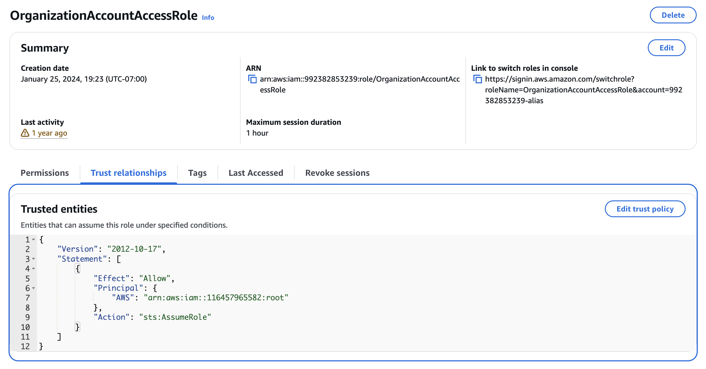
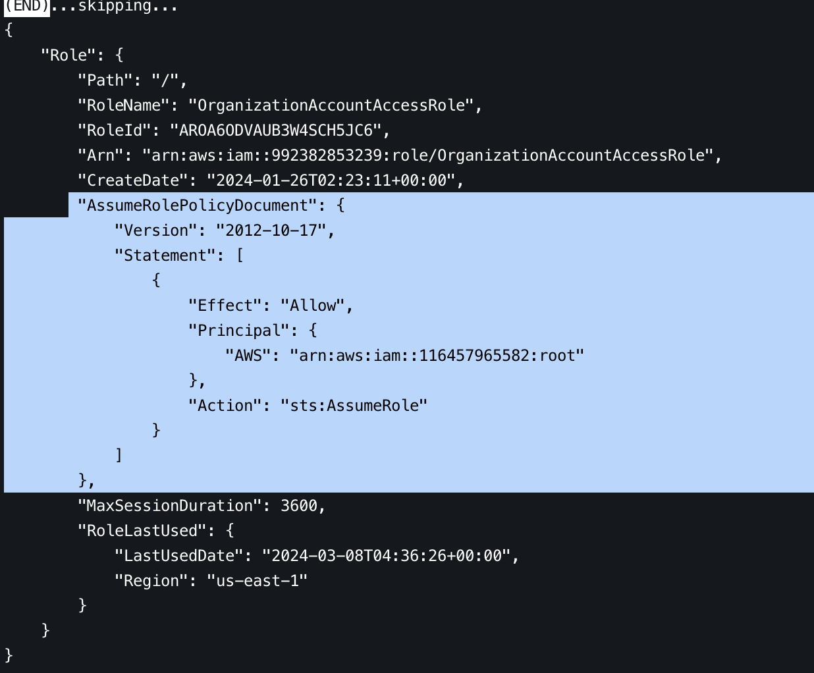
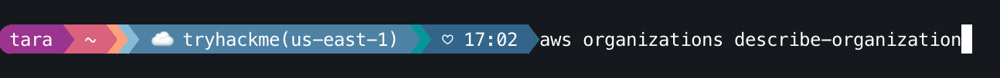
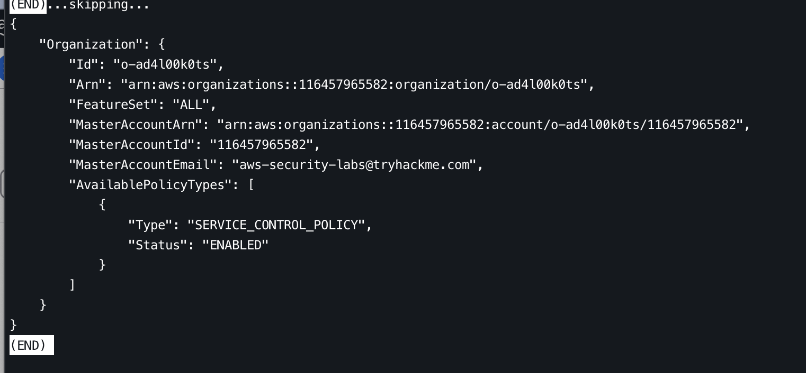
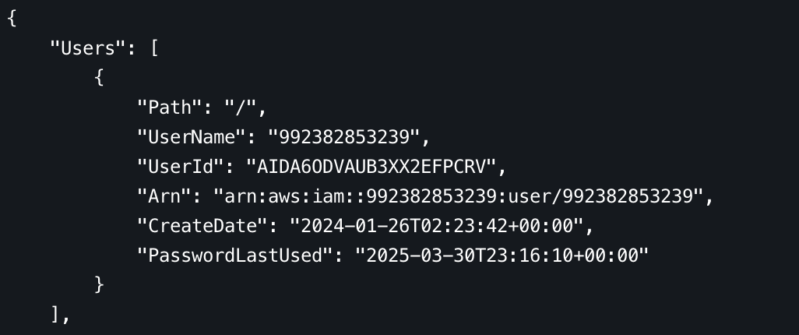
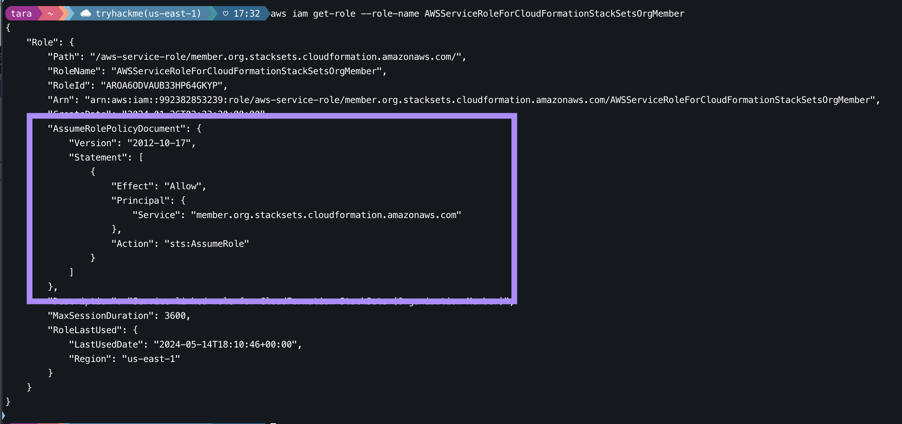

Here is my written walkthrough of the fourth room in the TryHackMe **[Attacking and Defending AWS](https://tryhackme.com/path/outline/attackinganddefendingaws)** learning path. This room gets into more details about AWS IAM principals.

> **✨📺**
> If you want to see some extremely cringe youtube-ing, check out my [video walkthrough](https://youtu.be/bqayurUj1bU?si=JFop3313yF4x9S9I) of this room.

## About this room

This room provides hands-on experience with AWS IAM principals in a cloud sandbox. This is an exciting room because, for the first time in the learning path, we get to do real things hands-on in AWS. Yeehaw 🤠. 

## Tasks

### Task 1 - Introduction to IAM Principals

Don't get too excited yet! First we do some reading refreshing our memory on what an IAM principal is. Principals are identites/entities you can attach IAM policies to. IAM policies grant permission to use specific AWS APIs to do specific actions in AWS, like `s3:CreateBucket` for example.

🚩 There is no flag. We just read and click the button.

### Task 2 - Access the Environment

This task teaches us to access the sandbox AWS environment. I won't recap it because if you are doing the room as you read this, the best thing to do is just follow the instructions. A couple of the most important things that jumped out at me:

&star; We get AWS console access via username and password, and we get an Access Key ID and Access Key we can use for the AWS CLI (generally my preference).
&star; The environment can be generated and reset (up to 3 times per day). Trust me it can definetely be reset. I did it several times whilst going through the path and gettings things into a FUBAR state.
&star; The same AWS environment is shared across multiple IAM rooms

> **🤓 SIDENOTE**
> I'm a nerd for this stuff so I tried to poke around a bit. Looks like THM deploys the lab resources with CloudFormation. Not sure how they vend their lab AWS accounts, but a lot of people vend AWS accounts with Terraform. Kind of interesting how they use the AWS account ID as the username for the lab credentials. Never seen that before.

🚩 Once you have successfully accessed the sandbox, click the button to move on. 

### Task 3 - IAM Users

We learn about IAM users:

&star; IAM users are the most basic form of IAM principal
&star; They represent people or applications (though roles are more common - and better - for applications)
&star; Users exist in a single AWS account
&star; Users can have:
  - A login profile (password for AWS console access - like we have in this lab)
  - Up to two access keys (for programmatic access - for example with the CLI)

If we use our lab access keys to auth with the AWS CLI, we can run some commands to learn more about our lab IAM resources.

`aws iam list-users`

We currently have two users in our lab AWS account, and that's the user we just used to log in to the console, with the account ID user name and the other is a user called `TryHackMe-IAM-User`.

`aws iam list-access-keys --user-name <aws account username>`

 Our user has one attached AWS access key.

> <div class="flag-toggle">🚩 There are two IAM Users in your account. The one you're using is the 12-digit account ID. What is the name of the other user?</div>
> 
> <div class="flag-content">
> <code>TryHackMe-IAM-User</code> we can see this in the AWS console or by running `aws iam list-users`.
> </div>

### Task 4 - IAM Roles

This task focuses on IAM roles, which are generally the better option whenever possible. 

&star; Roles are IAM principals intended to be assumed by a service, application or person to grant temporary permissions
&star; Roles have an attached `AssumeRoleTrustPolicy` that determines which other IAM principals can assume the role
&star; The `sts:AssumeRole` API call is used to assume the role. If the `sts:AssumeRole` caller is in the trust policy, the api call will return temporary session credentials for the role.

To get the flag, we need to find the Trusted Entity for the `OrganizationalAccountAccessRole`. We can do this in a couple of ways.

1. We can look at the role trust policy in the console.

    
    
2. We can use the AWS CLI `aws iam get-role --role-name OrganizationAccountAccessRole` command and look at the trust policy.

    

The trusted entity will be in the `Principal` field. Note that trusted entities ending with `root` like this: 

```
"Principal": {
        "AWS": "arn:aws:iam::116457965582:root"
      },
```

mean that any IAM entity in the `116457965582` can assume the role.

> <div class="flag-toggle">🚩 There are several roles in your account. What is the Trusted Entity for the OrganizationAccountAccessRole role?</div>
> 
> <div class="flag-content">
> <code>arn:aws:iam::116457965582:root</code> 


> </div>

### Task 5 Root User & AWS Account

This task teaches us about the Root user. A few takeaways here:

&star; The Root user has full privileges in the account unless subject to an Service Control Policy
&star; You should not use the root user for day-to-day activity - it only should be used for rare account management actions
&star; It's critical to ensure the mailbox for the email address associated with the root user email is regularly monitored - this is where AWS will send communications. This email also needs to be secured, or else attackers can attempt password reset attack tactics to gain access to your AWS account.

It's not for other IAM users to see the root account email, however, if the account is in an organization, we can figure out the email address of the Organization's Master Account.

```
aws organizations describe-organization
```





We are in the organization with ARN `arn:aws:organizations::116457965582:organization/o-ad4l00k0ts`, MasterAccountId `116457965582` and MasterAccountEmail `aws-security-labs@tryhackme.com`.

> **NOTE**
> Notice we can also see that the organization has a service control policy `ENABLED`. Notice also that the `116457965582` account id is the same account ID that is our trusted entity we found in task 4.

> <div class="flag-toggle">🚩 What is the MasterAccountEmail for your TryHackMe account?</div>
> 
> <div class="flag-content">
> <code>aws-security-labs@tryhackme.com</code>

### Task 6 IAM Groups

Next we learn about IAM Groups. IAM Groups are used to organize IAM users. And (if you ~have~ to use users) it's often a best practice to put your users in groups and apply permissions at the group level.

We can see the groups in our account with

`aws iam list-groups`

and we can see the users in a group with 

`aws iam get-group --group-name <group name>`

According to THM, IAM Groups are not Principals because they are only a grouping of entities, not an authenticated entity themselves. Which makes sense.

To figure out the flag, we need to figure out which group our IAM user is in. We can figure this out in the [AWS Console](https://us-east-1.console.aws.amazon.com/iam/home?region=us-east-1#/groups), or by investigating the two groups we found when we ran the `aws iam list-groups` command.

The first group is called `IAMModule-Group` so we can start with:

`aws iam get-group --group-name IAMModule-Group` 

and see if our lab user (with the user name matching the account ID) is in this group. 



In my case, the user is `arn:aws:iam::992382853239:user/992382853239`

> <div class="flag-toggle">🚩 What is the name of the IAM Group your IAM User is currently a member of?</div>
> 
> <div class="flag-content">
> <code>IAMModule-Group</code>

### Task 7 AWS Services

Here we learn more about how AWS services assume roles to do API actions in AWS. We also learn about how AWS API action names aren't always consistent or intuitive. For example, the call to create a VPC is `ec2:CreateVPC` and not `vpc:CreateVPC`. And some services use `list` while others use `describe` for very similar actions. 

This task teaches us how AWS services are used as principals in IAM role trust policies. We are asked to figure out what AWS service is allowed to assume the `AWSServiceRoleForCloudFormationStackSetsOrgMember`role.

We can do this using the same `get-role` command we learned in task 4, just with a different role name as an argument.

`aws iam get-role --role-name AWSServiceRoleForCloudFormationStackSetsOrgMember`



We can see an example of how AWS services are used as Principals in IAM policies. This policy lets the CloudFormation stacksets service entity assume the `AWSServiceRoleForCloudFormationStackSetsOrgMember` role. The `AWSServiceRoleForCloudFormationStackSetsOrgMember` role.

> **✨ Bonus** we can also see what policies are attached to this role with `aws iam list-attached-role-policies --role-name AWSServiceRoleForCloudFormationStackSetsOrgMember`.

> <div class="flag-toggle">🚩 What AWS Service is trusted to assume the Role “AWSServiceRoleForCloudFormationStackSetsOrgMember”?</div>
> 
> <div class="flag-content">
> <code>member.org.stacksets.cloudformation.amazonaws.com</code>

### Task 8 Everyone

Here we learn about how the `*` principal is a wildcard which represents **EVERYONE**. Depending on the situation **EVERYONE** could mean every principal in AWS, or it could even mean anyone which access to the internet. In the case of something like `"Principal": {"*"}`, in an S3 bucket policy, it could mean anyone on the whole internet could download files from your S3 bucket. [(Not that that's ever happened before)](https://www.google.com/search?q=s3+public+access+misconfiguration+examples).

There is no 🚩 to find here. We just have to promise we will be careful with our buckets and hit **Complete**.

### Task 9 Federated Identities

For most enterprise AWS environments, you will probably be using federated identities. This task explains how AWS works with things like identity providers and SAML authentication to allow federated identities to assume roles in AWS using their identity with an external identity provider (like a Microsoft Active Directory identity store for example).

In our lab account, there is a Sample SAML Identity Provider set up for us to find. The instructions give a [direct link](https://us-east-1.console.aws.amazon.com/iamv2/home#/roles/details/TryHackMe-IAM-Role?section=trust_relationships) to find it. We can see that a trust policy gives the SAML provider permission to use the `sts:AssumeRoleWithSAML` API action to assume a role in our account.

> <div class="flag-toggle">🚩 What is the name of the Sample SAML Identity Provider in your account?</div>
> 
> <div class="flag-content">
> <code>TryHackMe-IAM-SAMLProvider</code>

### Task 10 Conclusion

And that's it, we're done! A great introductory room in my opinion!